# Making a Cross Stitch Pattern from Images

This vignette covers the functions, process_image(), scree_plot(), color_strips() and make_pattern(), these functions can be used to execute kmeans clustering on images in a streamlined workflow. These functionalities are built on top of several R packages such as tidymodels, scales, cowplot, imager, tidyverse and dmc. It is strongly recommended to read the vignettes on all four functions to fully understand how the kmeans image clustering works, as these functions are meant to be used somewhat in order of each other.

We will be processing this Andy Warhol art piece shown below.
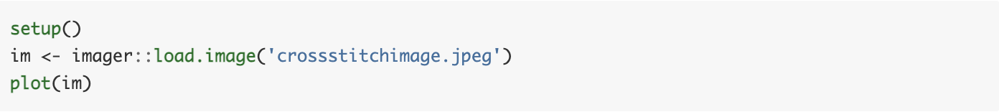
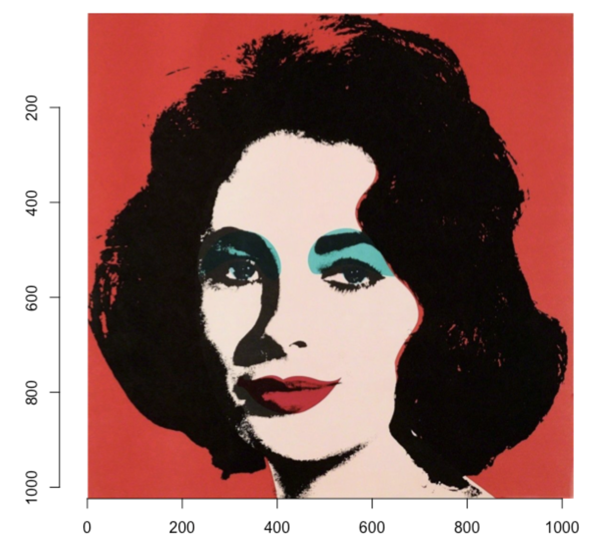

## FUNCTION ONE: process_image()

The process_image() function provides us with a way to convert images (jpeg or png) into kmeans data.

The first input to process_image() is the file path of the image that will be subject to clustering. If one is to set the working directory to a specific folder, there is no need to execute the function by inputting the entire file path of the image.
In the case below, we have set the working directory and have inputted the image file name into the process_image function. The same output can also be achieved by using the full file path of the image. Such as “/Users/harukatakagi/Desktop/AS1/crossstitchimage.jpeg”.

The second input to the process_image() function is the k value. This numerical value is the number of centres in the clustering. To determine this value, have a look at the image that is being inputted and count the general number of colors that exist in the image. We will be determining the most optimal k value with later functions, but this is a good way to start off the clustering process.

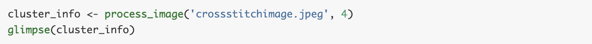
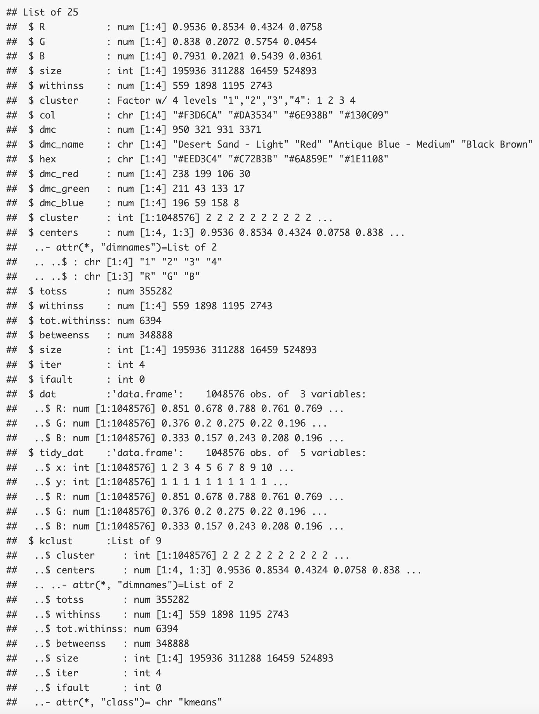

The output from process_image() consists of the kmeans clustering data on the input image, as a list. This includes the original output of the kclust calls, data on the tidied clusters, their associated RGB value and their nearest DMC thread color information; detailing their name, hex and dmc RGB values as well. The best way to get understand this output is to have a look around with View(cluster_info).

We will now use this data throughout the other functions to fine tune our kmeans clustering.

## FUNCTION TWO: scree_plot()
When executing the process_image() function we manually determined a k-value we thought was fit for clustering. What the scree_plot() will allow us to do is to determine the most optimal k-value for our image clustering.

The only input to the scree_plot() function is the cluster_info variable from the process_image() function. The output is executed below.

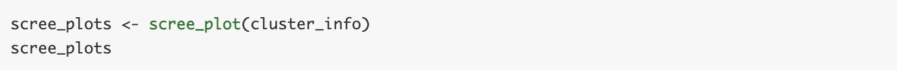
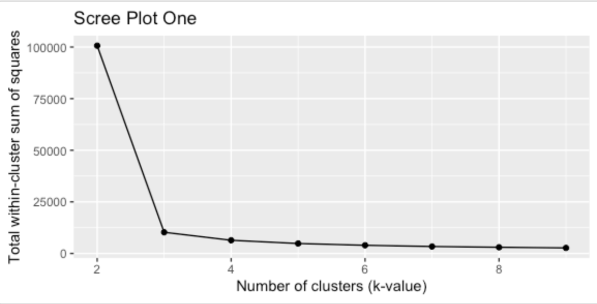
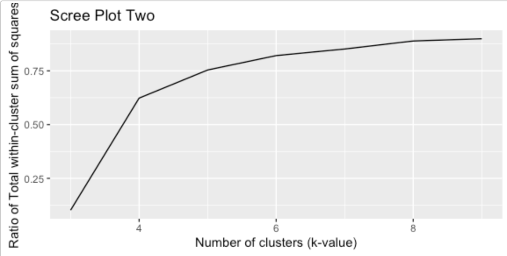

The first scree plot shows the relationship between the total within-cluster sum of squares according to the k-value. It shows how within-cluster scatter decreases as the k-value (number of clusters) increases. As the number of clusters increases the clusters become smaller, and become more compact. However, having too many cluster centers will not be very helpful in getting general image clustering; hence this choice of k is based on the principle of diminishing marginal returns. In the case above, it is difficult to see whether or not 3 or 4 is the best choice.

Let’s take a look at the second scree plot. This scree plot is the ratio of the relationship between the total within-cluster sum of squares and the k-value. In the ratio scree plot, there is a kink at which the number of clusters can reduce the scatter to a reasonable degree, while clusters do not become overly small. In this case, there is an elbow kink around 4, indicating that this is the most optimal k-value for clustering.

As we have just demonstrated, this step using the scree_plot() function is a very necessary step in determining the most optimal k-value for our image clustering.

## FUNCTION THREE: color_strip()
But it is still difficult to know whether the colors that have been extracted by the clustering techniques are good enough. It is best practice to check the extracted colors with human judgment. The function color_strip() is a very helpful function that produces the color strips extracted from the clustering algorithm with the DMC color closest to the cluster center color. The only input to the color_strip() function is the cluster_info variable from the process_image() function. The function outputs a grid of the extracted colors along with their DMC color hex values.

The output is executed below.

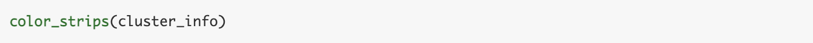
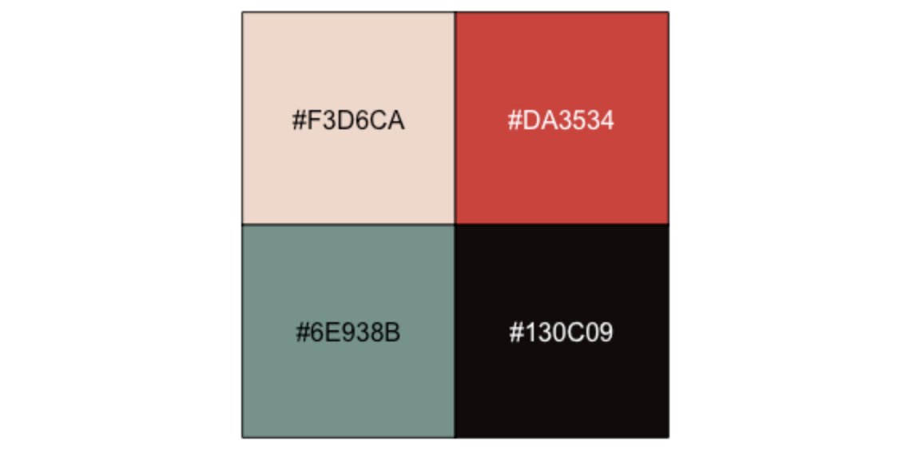

It is a noteworthy point that the output above has 4 colors, because we have executed the process_image() function with k = 4. In the event that by execution of the scree_plot() function, we were able determine a different optimal k-value, it is most advisable to re-run the process_image() function with the most optimal k-value. Then come back and execute the color_strip() function once more for a final check.

Even though in our case, k = 4 has been deemed the most optimal k-value, we will demonstrate what the color_strip() function output will look like when the k-value is not the most optimal.

We will execute process_image() and color_strips() where k is equal to 7. The output is shown below.

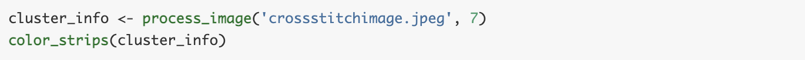
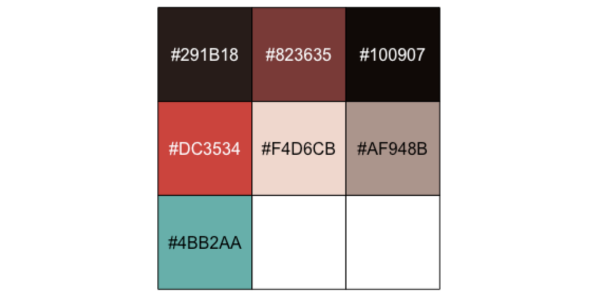

As you can see there are now 7 colors shown in the grid outputted from color_strips(). We can observed that out of these colors, (#291B18 & #100907), (#F4D6CB & AF948B) and (#DC3534 & #823635) are quite similar to each other. We can also observe that by looking at the original image, that some of these colors do not appear very much in the image or at all.

Our main takeaway here is that when the k-value is not at it’s optimal level, we will see excess or a lack of color variation when executing the function color_strips(). Hence, this function is a great way to check if you are on the right track to executing a effective image clustering model.

## FUNCTION FOUR: make_pattern()
We are near the end of the image clustering workflow. So far we have executed an initial kmeans clustering on the image, checked the optimal k-value with several scree plots and finally fine tuned the color variation in our clustering with a color grid visualization. All that is left to do is to put this all together and plot out our final image clustering to see how we did.

The function make_pattern() will produce the final ggplot cross stitch pattern of the input image, from our kmeans clustering. This function will allows us to produce several cross stitch patterns at our request; such as removing a background color or having our final output in black and white.

There are several inputs the make_pattern() function. The first necessary input is the cluster_info variable from the process_image() function. The second input is a numerical value indicating the number of centers in the clustering; this is also known as the k-value. We have determined the optimal k-value from the scree_plot() function, so let us use the results from there. The third input is a numerical value of the total number of possible stitches in the horizontal direction.

We have several default values for the make_pattern() function.

The fourth input to the function is the black_white input. This is a boolean logical value; if true the cross stitch will print in black and white; if false the cross stitch will print in color. The black_white input’s default value is false (print in color).

The fifth and last input to the function is the background_color. This is either a string or a NULL value. The inputted string must a hex value that has been extracted in clustering processes; evident from the function color_strips(). In the case of unwanted background color stitching, this function allows us to determine the hex color that we wish to be ignored in the cross stitch. The default value of this input is NULL, where all extracted hex colors will be taken into account for the cross stitch pattern.

From our previous work with other functions, we have been able to determine that k = 4 is the most optimal k value. We will choose a x-size value of 75, so we can clearly see the cross stitch pattern.

We first execute the cross stitch pattern with k = 4, color and no background color.
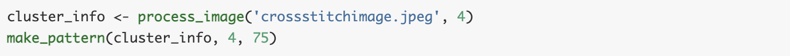
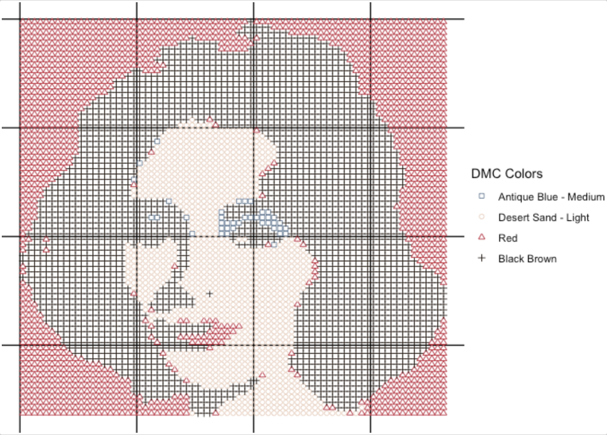

Here is what the black and white version of the same output would look like. This is with k = 4, black & white, and no background color.

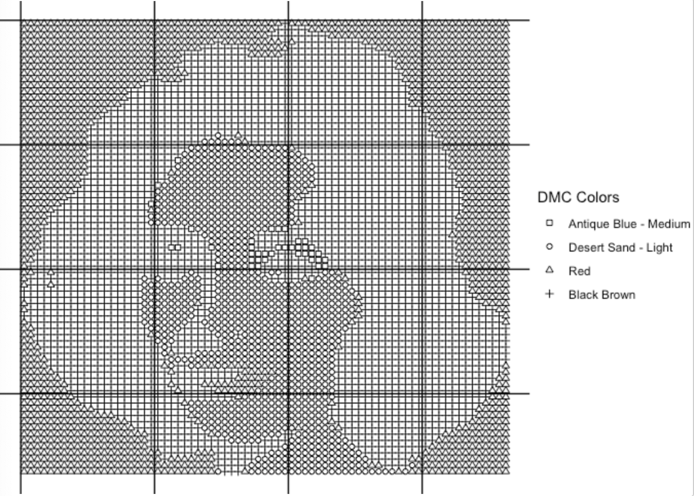

From our first output, we can see that the red color is the background color of this image. Here is what the output would look like if we wanted to remove this red background color from the cross stitch. This is with k = 4, color, and red background color.

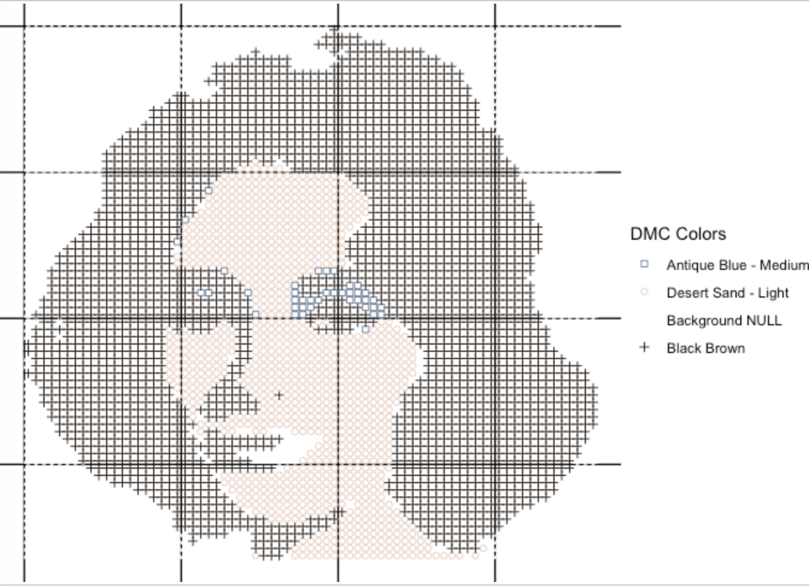

Lastly, here is what the cross stitch would look like with k = 4, black & white, removal of the red background color.

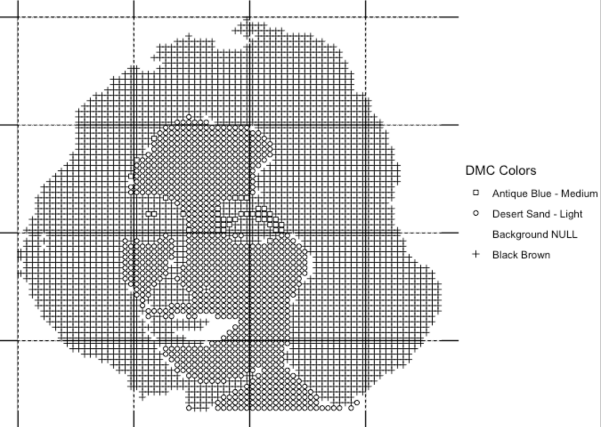

All these different cross stitches would be useful in different situations. Hopefully this vignette was able to help you go through the basic necessary steps to execute a meaning image k-means clustering task. Thank you for reading!

